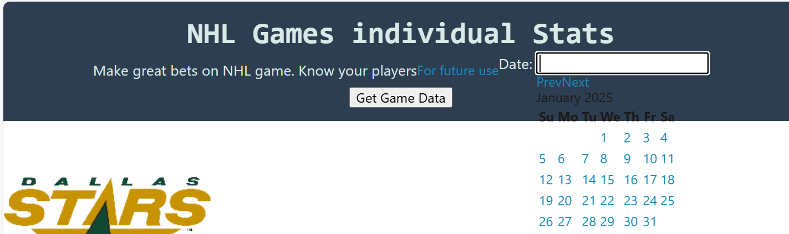
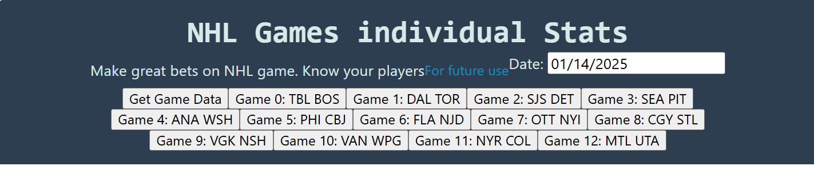

# NHLGamesBlog
This code allows user to post NHL game reviews online displaying stats that I particularly was intersted in. First a user will select date.  Then a user selkects game from the list pushing a button. JavaScript code will display game title, summary of goals and to the webpage. A user then will enter description of each goal and overall game description in two input located one above another. User cal also click button Print Roster to find players list, who scored or assisted on a goal.  

This script has been developed after another NHL stats page I created earlier: https://github.com/umnovjp/NHLStats. But it is built to post blog online. It has less stats functionality built in. Only goals, also goal shot locations chart. Website above has data for penalties, faceoffs, shots, blocked shots, goals, missed shots. And it could have more. But index.js file had 800 lines. I will redesign it to make files more manageable. Also, I will add team rosters and more stats data like hits, penalties, shots number, shot locations, including missed shots. 

There is no live page version. At least for now. If you would like to use it, download from github to local folder, then run it from your laptop. Still this repo has great examples of fs.readfile and fs.writefile. To start program, type node server.js in terminal. Then open http://localhost:3001 in your browser. 

## Future development
Current version was developed to use express.js to create a new blog. Later, I used current files to use databases instead of writing to file. Here is new repo: https://github.com/umnovjp/NHLGamesBlog. And in the future I will use REACT.js for live updates. And another plan in the future is to add shift chart analytics. 

## Games to run
WPG lines: 10/30, 11/01, 11/03, 11/05, 11/14, 11/16 FLA, 11/19 FLA, 11/22 PIT, 11/23 NSH, 11/25 MIN 7-27-91 9-15-36 13-55-81 17-22-62, data missing 11/07, 11/09,11/12, 
