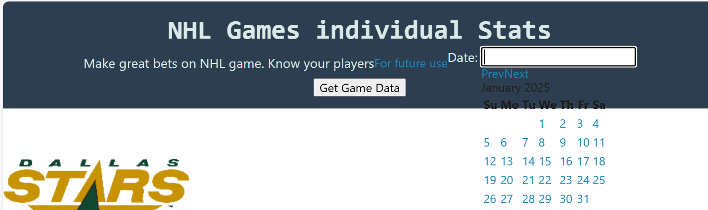
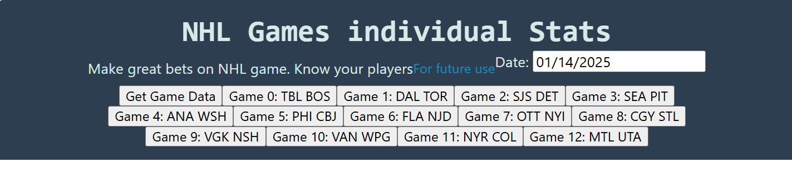
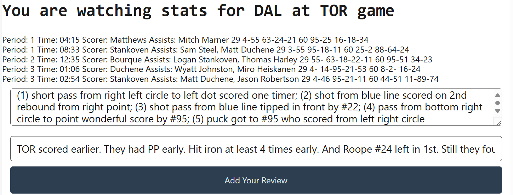
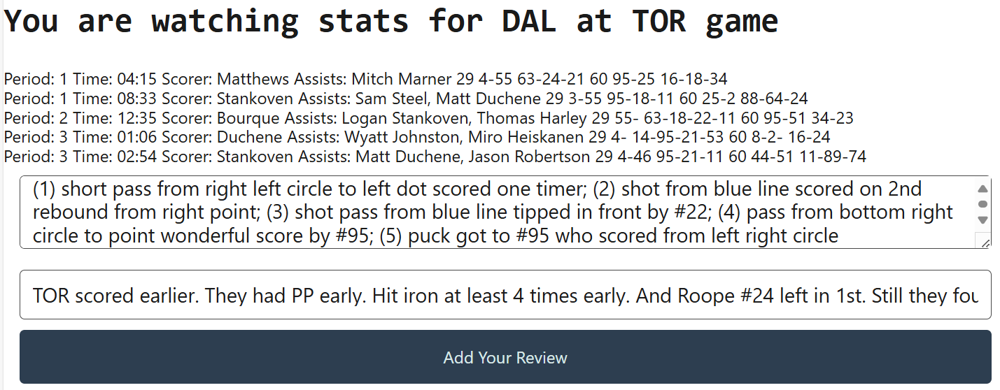

# NHLGamesBlog
This code allows user to post NHL game reviews online displaying stats that I particularly was intersted in. First a user will select date.  Then a user selkects game from the list pushing a button. JavaScript code will display game title, summary of goals and assists and lineups of players for both teams who were on ice when each goal was scored. . User then will enter description of each goal and overall game description in two input fields located one above another.

This script has been developed after another NHL stats page I created earlier: https://github.com/umnovjp/NHLStats. But it is built to post blog online. It has less stats functionality built in. Link above has data for penalties, faceoffs, shots, blocked shots, goals, missed shots. And I could add more data in the future.

There is no live page version. At least for now. If you would like to try it, download from github to local folder, then run it from your laptop. Still this repo has great examples of fs.readfile and fs.writefile. To start program, type node server.js in terminal. Then open http://localhost:3001 in your browser.

Current version was developed to use express.js to create a new blog. Later, I used current files to use databases instead of writing to file. Here is this repo: https://github.com/umnovjp/NHLGamesBlog. I did one react.js NHL project earlier. It kind of worked. Maybe I will make another attempt. 

## Future development
Later I may add more data to reflect which combination of players is on ice when goals are scored, maybe in previous games of the same team as well. But that's for long haul. NHL stats just show plus minus rating for each player. And that one is a little distorted because players do not get minus if goal is scored on PK. In the short term, it would make sense to show that some players were on ice for X goals for and Y goals against, counting those on PK. And check out this repo as well: https://github.com/umnovjp/NHLShiftsStats3. That's my next goal. And that's what I am proud of. Though job is in progress with algorithms changing frequently.  

## Games to run (to be deleted)
incorrect data game WPG SJC 02/24 SJC G is missing during 1st goal 3rd goal is wrong as well because same player is added twice #51. incorrect data stars at cbj on 2/25 on goal 9 same player counted twice. 

incorrect lineup stars goals 5,8,9 on 03/02 53 is counted as D and F. car game on 03/02 1st goal 7 players on ice? There is no #10 in CAR. game cgy at phi 03/04 same goal displayed twice. game 0 3/7 3D home team when 1st goal was scored. game sjc vs col 3/6 goalie is not in lineup goals 1 and 8. game 7 03/06 OT goal displayed twice. game 6 03/06 stars G missing OT goal. game 5 03/06 goalie counted twice goal 6. stl at pit game 03/13 goal recorded twice. vgk sabres game on 3/15 shutout goal recorded 3 times. incorrect lineup col stars game 03/16 last goal #53 shows up as d and as F. cgy vs nyr game 3/18 there is goal #4 which did not happen because of offside. stars tbl game 03/20 incorrect lineup during 4th goal goalie counted twice also incorrect SO goals all to Duchene. Stars game on 03/22 goalie was recorded in ot for away team. WPG WSH game 03/25 3rd goal WPG incorrect lineup #91 is D and F. stars game 4/5 vs PIT. last goal #53 recorded among D and F. lak vs edm game 4/21 no goalie 1st goal lak. stars game 05/01/25 #53 recorded both D and F goals 10 and 11. lak edm game on 05/01/25 96,14 counted as D and F on 6x5. game edm vgk on 5/6 last goal #33 is g and d. game on 5/11 stars goal #1 again #53 is F and D. 

## Just to review what I am doing (to be deleted)
There are 4 get routes (/, /feedback, /api/tips, /api/feedback) and 2 post routes (/api/feedback, /api/tips). / Forwards to /public/index.html file but /feedback forwards to /public/pages/feedback.html. Two more get routes just read from files. These routes are in server.js. But in 13.2.11 he explained we can use async await in routes, and not in server.js but in userRoutes.js. Turns out there is difference between just catch and try catch. Does not look very useful yet. Turns out async await were there in 13.1.9 and 13.1.10. that's way better over there. I add a review here but I do not add new elements dynamically in lessons 13-14 I can add new elements. This is called ORM. 

## Not related material how to apply exports (to be deleted)
9.15 index.js has `const badmath = require('./badmath.js')`. Full path is included. index.js has function or action: console.log something. badmath.js has one variable and one function that we are exporting using module.exports = {pie, predictable}. Then index.js knows what pie is and what predictable is. Then he reviewed 9.16. index.js to require ('./math.js') but math.js has function then it says module.exports = {function here}. Here is example: module.exports = {sum: (a,b) => a+b}. Then I can use math.sum in index.js. important development 13.2 around 36:50 when he used that to export routes. then another revellation async await. 